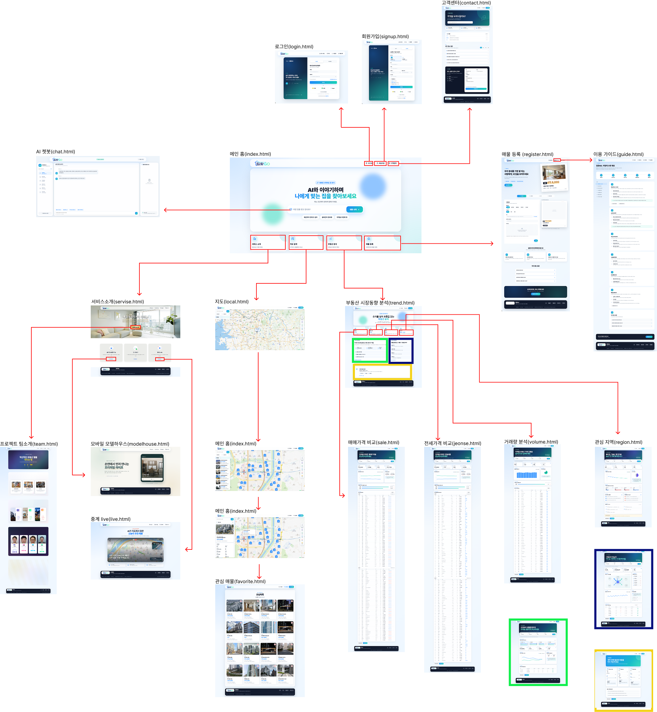

# 집찾GO (Zip-chatGo)

> AI 대화형 추천과 부동산 시장 데이터를 바탕으로, 사용자의 주거 조건에 맞는 지역과 매물을 탐색·비교할 수 있도록 만든 부동산 웹 서비스 프로젝트입니다.

[](https://kakaru-rgb.github.io/Zip-chatGo/)
[](#5-기술-스택)

## 1. 프로젝트명

**집찾GO (Zip-chatGo)**

- **Demo URL**: [https://kakaru-rgb.github.io/Zip-chatGo/](https://kakaru-rgb.github.io/Zip-chatGo/)
- **시연 방법**: 웹 브라우저 접속 후 로그인 화면에서 하단의 '게스트로 체험하기'를 클릭하여 게스트 계정으로 주요 기능을 확인하실 수 있습니다.
- **주요 범위**: AI 집 찾기, 지도 기반 매물 탐색, 시장동향 분석, 관심목록, 매물 등록, 회원 및 고객지원 UI

## 2. 프로젝트 소개

집찾GO는 여러 곳에 흩어진 부동산 매물과 시장 정보를 한 흐름에서 확인할 수 있도록 구성한 웹 서비스입니다. 사용자는 AI 대화형 질문을 통해 원하는 주거 조건을 정리하고, 지도에서 지역과 매물을 탐색한 뒤 실거래가·거래량·금리·학군·교통 등의 지표를 함께 비교할 수 있습니다.

현재 프로젝트는 HTML, CSS, JavaScript 기반 프론트엔드와 Node.js/Express 기반 시장동향 API 서버로 구성되어 있습니다. 지도와 샘플 매물은 로컬 JSON 데이터를 사용하며, 시장동향은 국토교통부 실거래가 OpenAPI를 호출하고 API 설정이 없을 때는 데모 데이터를 제공합니다. 로그인, 관심목록, 문의 등 일부 기능은 브라우저 저장소를 사용하는 시연용 구현입니다.

## 3. 프로젝트 목표

- 사용자의 지역, 예산, 주거 형태와 선호 조건을 단계적으로 정리하는 탐색 경험 제공
- 지도 매물과 생활 인프라, 학군 정보를 결합해 지역 비교에 필요한 맥락 제공
- 실거래가와 시장 지표를 시각화하여 합리적인 주거 의사결정 지원
- 매물 탐색부터 관심목록, 등록, 고객지원까지 주요 사용자 여정을 하나의 서비스로 연결
- 데스크톱과 모바일에서 사용할 수 있는 반응형 UI와 확장 가능한 데이터 구조 마련

## 4. 기획 의도

부동산 탐색은 매물의 가격과 위치뿐 아니라 교통, 학군, 생활편의시설, 시장 흐름 등 다양한 조건을 함께 판단해야 합니다. 집찾GO는 사용자가 복잡한 정보를 직접 찾아 조합하는 부담을 줄이고, 자신의 조건을 자연스럽게 정리해 적합한 지역과 매물을 비교하도록 돕는 것을 목표로 기획했습니다.

메인 페이지에서 AI 대화를 시작하고, 지도에서 매물과 주변 환경을 확인하며, 시장동향 화면에서 가격과 거래 흐름을 분석하는 구조로 핵심 동선을 연결했습니다. 여기에 로그인, 관심목록, 매물 등록, 이용가이드와 고객센터를 더해 실제 부동산 플랫폼에 가까운 서비스 흐름을 구현했습니다.

## 5. 기술 스택

| 영역 | 기술 | 활용 목적 |
| --- | --- | --- |
| Markup | HTML5 | 페이지별 시맨틱 구조와 서비스 화면 구성 |
| Styling | CSS3 | Flexbox, Grid, CSS 변수, 반응형 레이아웃 및 화면 전환 효과 구현 |
| Interaction | JavaScript (ES6+) | 대화 흐름, 검색·필터, 지도 제어, 폼 검증 및 동적 렌더링 |
| Map | Naver Maps JavaScript API | 매물, 지역, 생활편의시설과 학군 정보를 지도에 시각화 |
| Clustering | Supercluster | 대량의 지도 매물 마커를 확대 수준에 따라 클러스터링 |
| Public Data | 국토교통부 실거래가 OpenAPI | 아파트 매매·전월세 실거래 데이터 조회 |
| Data Parsing | fast-xml-parser | 공공데이터 XML 응답을 JavaScript 객체로 변환 |
| Storage | JSON / Web Storage API | 매물·POI·학군 데이터 관리, 로그인·관심목록·문의 임시 저장 |
| Collaboration | Git / GitHub | 버전 관리와 팀 협업 이력 관리 |
| Deployment | GitHub Pages | 정적 프론트엔드 데모 배포 |

## 6. 프로젝트 구조

```text
Zip-chatGo/
├── index.html                         # 메인 페이지
├── templates/
│   ├── ai/
│   │   └── chat.html                  # AI 대화형 집 찾기
│   ├── favorite/
│   │   └── favorite.html              # 관심 매물 목록
│   ├── market/                        # 시장동향 상세 분석 화면
│   │   ├── trend.html                 # 시장동향 종합
│   │   ├── sale.html                  # 매매가격 분석
│   │   ├── jeonse.html                # 전세가격 분석
│   │   ├── volume.html                # 거래량 분석
│   │   ├── region.html                # 지역별 분석
│   │   ├── region-flow.html           # 지역 이동 흐름
│   │   ├── rate.html                  # 금리 분석
│   │   ├── school.html                # 학군 분석
│   │   ├── traffic.html               # 교통 분석
│   │   └── ai-report.html             # AI 리포트 형식 분석
│   ├── member/
│   │   ├── login.html                 # 로그인
│   │   ├── signup.html                # 회원가입
│   │   └── mypage.html                # 마이페이지(미구현)
│   ├── property/
│   │   ├── map.html                   # 지도 기반 매물 탐색
│   │   ├── register.html              # 매물 등록
│   │   └── search.html                # 매물 검색 전용 화면(미구현)
│   └── support/
│       ├── Servise.html               # 서비스 소개
│       ├── guide.html                  # 이용가이드
│       ├── contact.html                # 고객센터
│       ├── live.html                   # 추천 매물 LIVE
│       ├── modelhouse.html             # 온라인 모델하우스
│       ├── team.html                   # 프로젝트 팀 소개
│       └── notice.html                 # 공지사항(미구현)
├── static/
│   ├── css/                            # 공통 및 페이지별 스타일
│   ├── js/                             # 화면 기능과 시장 분석 스크립트
│   ├── images/                         # 로고, 팀원, 매물 등록 예시 이미지
│   └── data/
│       ├── properties.json             # 지도용 매물 데이터(약 4,970건)
│       ├── poi_database.json           # 생활편의시설 POI 데이터
│       └── *_zones_*.json              # 초·중·고 학군 경계 데이터
├── server/
│   ├── server.js                       # 정적 서버 및 시장동향 API
│   ├── package.json
│   └── package-lock.json
└── README.md
```

## 7. UI 핵심 기능

- **AI 대화형 집 찾기**: 지역, 예산, 주거 형태와 중요 조건을 단계적으로 입력하고 진행률, 조건 요약, 추천 지역 카드를 확인할 수 있습니다. 현재 생성형 AI가 아닌 규칙 기반 데모로 동작합니다 (미구현)
- **지도 기반 매물 탐색**: Naver Maps에서 약 4,970개의 매물을 검색하고 주택 유형·거래 유형·가격·면적 등으로 필터링합니다. Supercluster 기반 클러스터, 확대 단계별 지역 표시, 매물 카드와 상세 팝업을 제공합니다.
- **주변 환경 비교**: 편의점, 병원, 교통 등 생활편의시설 POI를 표시하고 거리 측정 도구, 초·중·고 학군 경계와 학군 상세 정보를 함께 제공합니다.
- **시장동향 분석**: 매매·전세·거래량·지역 흐름·금리·학군·교통 지표를 차트와 표로 구성하고, 기준 지역과 비교 지역을 함께 분석합니다. 국토교통부 OpenAPI 설정이 없으면 데모 데이터로 동작합니다.
- **관심목록**: 지도에서 선택한 관심 매물 ID를 `localStorage`에 저장하고 별도 관심목록 화면에서 카드 형태로 조회하거나 삭제할 수 있습니다.
- **로그인 및 회원가입**: 회원 유형 선택, 입력값 검증, 약관 동의, 게스트 체험, 로그인 상태별 메뉴와 로그아웃을 제공합니다. 현재 인증 정보는 브라우저에 임시 저장됩니다.
- **매물 등록**: 기본정보 → 상세정보 → 사진 → 확인·등록의 4단계 폼, 다중 이미지 업로드와 미리보기, 가격·연락처 입력, 실시간 매물 미리보기를 제공합니다. 서버 영구 저장은 연결 전입니다.
- **고객지원 및 콘텐츠**: 이용가이드, FAQ 검색·분류, 1:1 문의 임시 저장, 서비스·팀 소개, 추천 매물 LIVE와 온라인 모델하우스 화면을 제공합니다.
- **반응형 화면 구성**: 공통 내비게이션과 카드 중심의 정보 구조를 사용하고 모바일 메뉴와 화면 크기별 레이아웃을 지원합니다.

### 현재 구현 현황

| 기능 | 상태 | 동작 방식 |
| --- | --- | --- |
| 메인 및 페이지 내비게이션 | 구현 | 정적 콘텐츠 + JavaScript 상호작용 |
| AI 대화 추천 | 데모 구현 | 규칙 기반 JavaScript |
| 지도 매물·POI·학군 탐색 | 구현 | Naver Maps + Supercluster + 로컬 JSON |
| 시장동향 분석 | 구현 | 국토교통부 OpenAPI 또는 데모 데이터 |
| 로그인·회원가입 | 데모 구현 | `localStorage` 기반 인증 상태 |
| 관심목록 | 데모 구현 | `localStorage` + 매물 JSON |
| 매물 등록 | UI 구현 | 이미지 미리보기 및 폼 검증, 서버 저장 미연결 |
| 이용가이드·고객센터 | 구현 | 정적 콘텐츠 + 문의 임시 저장 |
| 서비스·팀·LIVE·모델하우스 | 구현 | 콘텐츠 및 화면 상호작용 |
| 매물 검색 전용 화면 | 미구현 | `templates/property/search.html`이 비어 있음 |
| 마이페이지 | 미구현 | `templates/member/mypage.html`가 비어 있음 |
| 공지사항 | 미구현 | `templates/support/notice.html`이 비어 있음 |
| 실제 생성형 AI·회원/매물 DB | 미구현 | 외부 AI API, 인증 서버 및 DB 연동 필요 |

## 8. 개발 일정
- **개발 기간**: 1일 2시간 6주
- **개발 방식**: 기능별 담당자가 페이지와 데이터를 구현하고 Git/GitHub로 통합

| 단계 | 목표 | 주요 작업 내용 |
| --- | --- | --- |
| 1단계 | 기획 및 공통 구조 설계 | 서비스 목표, 사용자 흐름, 담당 영역, 공통 디자인과 디렉터리 구조 정의 |
| 2단계 | 핵심 화면 제작 | 메인, AI 대화, 서비스 소개, 회원, 가이드와 고객센터 기본 화면 구현 |
| 3단계 | 데이터 기능 구현 | 지도 매물·클러스터·필터, 시장동향 차트와 공공데이터 API, 매물 등록 폼 구현 |
| 4단계 | 기능 확장 | 지도 POI·학군·거리 측정, 관심목록, 사진 업로드, LIVE·모델하우스·팀 소개 추가 |
| 5단계 | 통합 및 보완 | 페이지 연결, 로그인 상태 연동, 반응형 UI, 데이터·이미지 정리와 문서 업데이트 |

## 9. 팀원 및 역할

| 이름 | 담당 영역 | 주요 작업 |
| --- | --- | --- |
| **안종범** | 지도 기반 매물 탐색 | Naver Maps 화면, 매물 데이터 조사·가공, 클러스터와 검색·필터, POI·학군·거리 측정 및 상세 정보 기능 |
| **이승호** | 메인, 시장동향, 회원 기능 | 메인 진입 흐름, 시장동향 세부 화면과 차트, 국토교통부 OpenAPI 연동 서버, 로그인·회원가입 UI |
| **맹준영** | 매물 등록, 이용가이드, 고객센터 | 4단계 매물 등록 폼, 사진 업로드와 실시간 미리보기, 이용 절차·FAQ, 문의 입력 및 임시 저장 |
| **황상옥** | 서비스 및 프로젝트 소개 | 서비스 핵심 가치와 이용 흐름, 팀 소개 콘텐츠와 화면 디자인 구성 |

## 10. 사용자 동선

사용자가 서비스를 이용하며 거치는 핵심 흐름입니다.


```text
메인 페이지
├─ AI와 집 찾기 → 조건 입력 → 추천 지역 → 지도·시장동향 확인
├─ 지도에서 찾기 → 검색·필터 → 매물/주변 환경 비교 → 관심목록 저장
├─ 시장동향 → 지역 선택 → 매매·전세·거래량 등 세부 지표 분석
├─ 매물 등록 → 기본정보 → 상세정보 → 사진 → 확인·등록
└─ 로그인/회원가입 → 관심목록·등록 기능 이용 → 가이드/고객센터
```

## 11. 개선 보완 사항

- 페이지마다 중복된 헤더·푸터와 CSS를 공통 컴포넌트 및 스타일 규칙으로 통합
- `Servise.html`, `singup.html` 등 파일명과 일부 화면의 `집챗GO` 표기를 `집찾GO`로 일관되게 정리
- 비어 있는 링크 대상과 잘못된 상대 경로를 정리하고 GitHub Pages와 로컬 서버에서 동일하게 동작하도록 개선
- 대용량 매물·이미지 데이터의 지연 로딩, 썸네일 최적화 및 초기 지도 렌더링 성능 개선
- Naver Maps 클라이언트 키와 공공데이터 인증키를 안전한 환경 설정으로 분리
- 키보드 탐색, ARIA 속성, 색상 대비, 폼 오류 안내 등 웹 접근성 보완
- 빈 결과, 로딩, API 오류, 데이터 누락 상태에 대한 공통 UI 마련
- 브라우저·화면 크기별 통합 테스트와 주요 JavaScript 기능의 자동화 테스트 추가

## 12. 향후 개발 예정

- **매물 검색 및 상세 화면**: 전용 검색 결과, 상세 매물 정보, 이미지 갤러리와 중개 정보 제공
- **마이페이지 및 공지사항**: 회원 정보, 등록·관심·문의 이력 관리와 서비스 공지 화면 구현
- **실제 인증 및 데이터베이스**: 비밀번호 암호화, 세션/토큰 인증과 회원·매물·관심·문의 데이터 영구 저장
- **생성형 AI 연동**: 자연어 조건 분석과 실제 매물 데이터에 기반한 추천·설명 생성
- **매물 등록 관리**: 등록·수정·삭제, 이미지 업로드 저장소, 중개사/관리자 검수 기능 연결
- **데이터 자동 수집**: 공공데이터와 외부 부동산 정보를 주기적으로 갱신하는 수집 파이프라인 구축
- **알림 및 개인화**: 관심 지역의 신규 매물, 가격 변동, 조건별 추천 알림 제공

## 13. 기대 효과

- **사용자**: 매물, 주변 환경과 시장 데이터를 한 화면 흐름에서 비교해 주거 선택에 필요한 시간과 탐색 부담 절감
- **운영자**: 검색·관심·문의·등록 흐름을 기반으로 개인화 기능과 서비스 운영 전략을 확장할 수 있는 기반 확보
- **개발팀**: 지도, 시장 데이터, 회원·지원 화면을 모듈별로 확장하고 실제 AI·백엔드·DB 서비스로 발전시킬 수 있는 구조 마련
